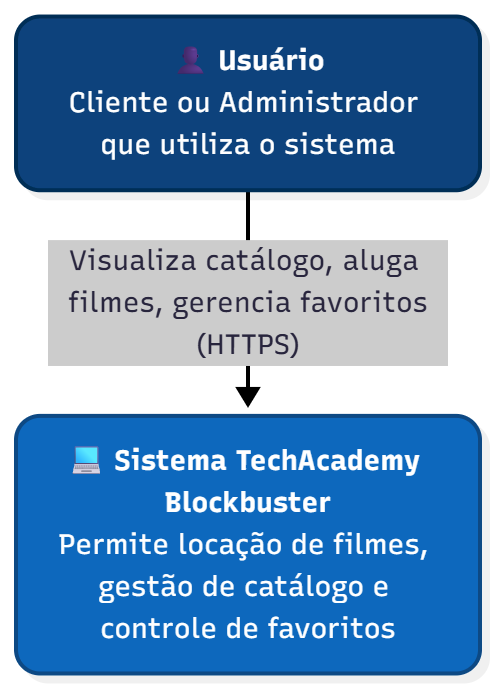
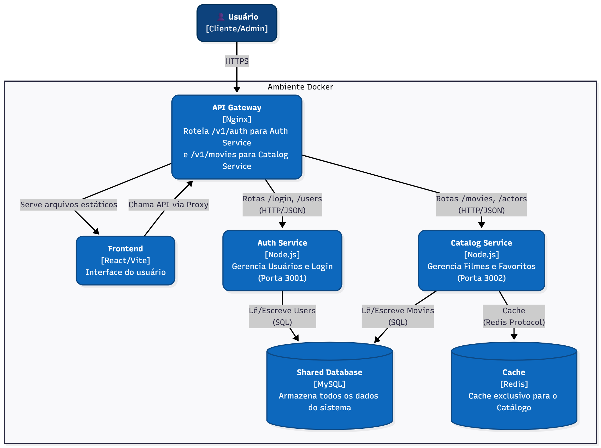

# 🏗️ Documentação Arquitetural

## 1. Diagramas C4

### Nível 1: Diagrama de Contexto
Este diagrama situa o sistema no mundo, mostrando quem o utiliza.

### Nível 2: Diagrama de Containers
Este diagrama mostra a decomposição do sistema em serviços independentes.

---

## 2. Registro de Decisões Arquiteturais (ADRs)

### ADR-001: Adoção de Arquitetura de Microsserviços
* **Status:** Aceito.
* **Contexto:** O sistema está crescendo e diferentes domínios (Catálogo vs Identidade) possuem ciclos de vida e requisitos de escala distintos. O time deseja implantar funcionalidades de catálogo sem arriscar a estabilidade do login.
* **Decisão:** Optou-se por dividir o backend em serviços independentes:
    1.  **Auth Service:** Responsável por cadastro e autenticação de usuários.
    2.  **Catalog Service:** Responsável pela gestão de filmes, atores e favoritos.
* **Consequências:**
    * (+) **Escalabilidade Independente:** Podemos replicar apenas o serviço de Catálogo (que tem mais leitura) sem gastar recursos com o serviço de Auth.
    * (+) **Isolamento de Falhas:** Se o Catálogo cair, o usuário ainda consegue logar (e ver outras partes do sistema futuramente).
    * (-) **Complexidade Operacional:** Necessidade de orquestrar múltiplos containers e gerenciar rotas no Gateway (Nginx).

### ADR-002: Banco de Dados Compartilhado (Shared Database)
* **Status:** Aceito (Temporário).
* **Contexto:** Para simplificar a migração do monólito para microsserviços, optou-se por não dividir o banco de dados fisicamente neste momento.
* **Decisão:** Ambos os serviços (`auth` e `catalog`) conectam-se à mesma instância MySQL.
* **Consequências:**
    * (+) **Simplicidade:** Não é necessário refatorar queries complexas ou lidar com consistência eventual entre bancos agora.
    * (-) **Acoplamento:** Alterações de schema em tabelas compartilhadas podem quebrar ambos os serviços.

---

## 3. Cenários de Qualidade (Quality Scenarios)

### 🟢 Disponibilidade (Availability)
* **Cenário:** Falha no serviço de Catálogo.
* **Estratégia:** O `auth-service` roda em container separado. O login continua funcionando mesmo se o catálogo estiver offline, garantindo que o usuário acesse sua conta (Isolamento de Processos).

### 🚀 Desempenho (Performance)
* **Cenário:** Alta demanda de leitura de filmes.
* **Estratégia:** O `catalog-service` possui cache exclusivo via Redis, aliviando o banco compartilhado. O `auth-service` não compete por conexões do Redis, pois não o utiliza.
