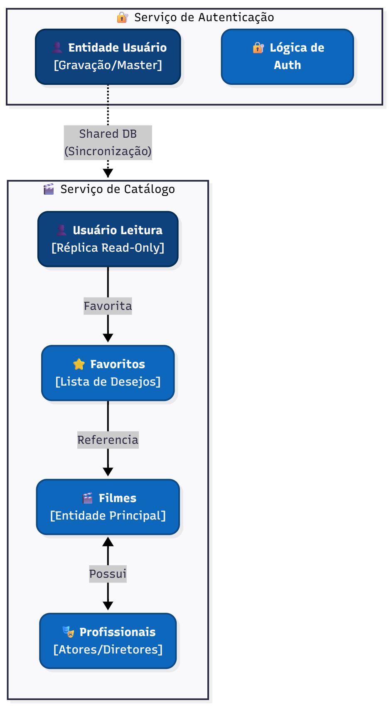

# 🏛️ Estilos Arquiteturais e DDD

Detalhamento da modelagem tática e estratégica do sistema sob a ótica do Domain-Driven Design (DDD).

## 1. Context Map (Mapa de Contextos)

O sistema, embora implementado como um monólito modular, possui fronteiras lógicas claras entre os domínios de negócio. O diagrama abaixo ilustra os domínios e seus relacionamentos.

---

## 2. Definição de Bounded Contexts

Baseado na organização das rotas (`src/routes`) e modelos (`src/models`), identificamos 3 principais Contextos Delimitados:

### A. Contexto de Catálogo (Core Domain)
É o coração do negócio. Responsável por manter a integridade e consistência do acervo de filmes.
* **Responsabilidades:** Cadastro, edição e listagem de filmes, atores e diretores.
* **Módulos no Código:** `Movie`, `Actor`, `Director`, `Cast`, `DirectorMovie`.

### B. Contexto de Identidade (Generic Subdomain)
Trata de questões transversais de segurança e acesso, necessárias para qualquer sistema moderno.
* **Responsabilidades:** Registro de usuários, Login (JWT) e Controle de Acesso (Admin vs Usuário Comum).
* **Módulos no Código:** `User`, `Session`.

### C. Contexto de Engajamento (Supporting Subdomain)
Suporta o negócio aumentando a retenção do usuário através de personalização.
* **Responsabilidades:** Permitir que usuários salvem filmes para ver depois.
* **Módulos no Código:** `Favorite`.

---

## 3. Entidades, Value Objects e Aggregates

Detalhamento tático focado no **Contexto de Catálogo**, mapeando como os objetos do ORM (Sequelize) se traduzem em conceitos de DDD.

### Aggregate: Movie (Filme)
O `Movie` atua como a raiz (Root) deste agregado, pois é a entidade central em torno da qual as outras giram.

* **Entities (Entidades):**
    * **Movie (Root):** Possui identidade única (UUID) e ciclo de vida próprio.
        * *Atributos:* `id`, `title`, `description`, `release_date`, `duration`.
    * **MovieImage:** Entidade dependente que armazena referências visuais (poster/banner). Só faz sentido existir vinculada a um Filme.

* **Value Objects (Objetos de Valor):**
    * *Conceitual:* Atributos como `Rating` (classificação indicativa) ou `Genre` (gênero) são implementados como strings/inteiros no banco, mas conceitualmente representam Value Objects imutáveis.

### Aggregate: Profissionais (Cast & Crew)
Atores e Diretores são tratados como agregados independentes para permitir que existam sem estarem atrelados a um filme específico (reusabilidade).

* **Entities:**
    * **Actor:** Profissional de atuação. Identidade única (UUID).
    * **Director:** Profissional de direção. Identidade única (UUID).

### Relacionamentos entre Agregados
As tabelas pivot do banco de dados representam as relações de domínio:

* **Cast (Elenco):** Vincula `Movie` e `Actor`. No domínio, representa "Um ator interpretando um papel em um filme".
* **DirectorMovie:** Vincula `Movie` e `Director`. Representa "A direção criativa de um filme".
