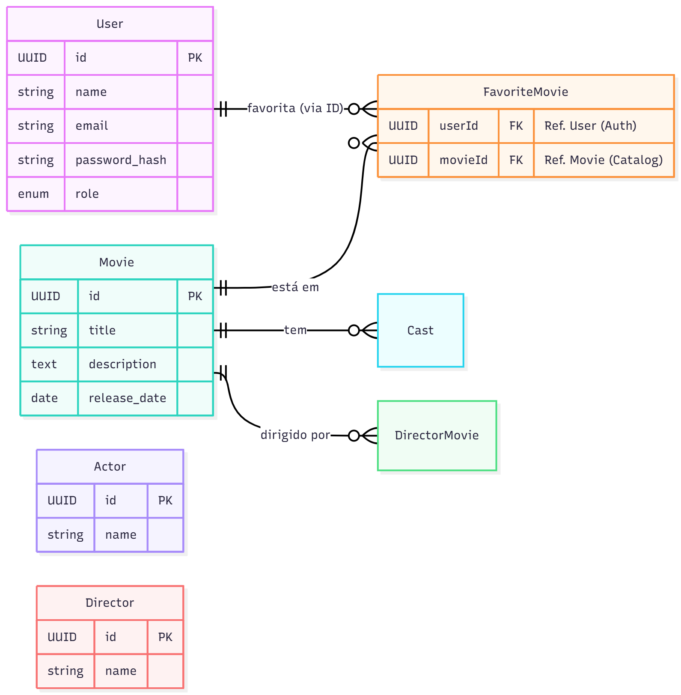

# 🔌 Etapa 3: Integração, APIs e Dados

Esta seção documenta a interface de comunicação do sistema (API) e a estratégia de persistência de dados.

## 1. Especificação da API (OpenAPI/Swagger)

O projeto adota uma abordagem **Code-First** para a documentação da API. As especificações OpenAPI (Swagger) são geradas automaticamente a partir das anotações no código-fonte (JSDoc) e arquivos de configuração.

* **Localização da Configuração:** `backend/src/config/swagger.ts`
* **Acesso à Documentação Interativa:**
    * URL Local: `http://localhost:3000/v1/docs` (Quando o servidor backend está rodando)
    * Formato: Swagger UI

### Principais Endpoints Mapeados
A documentação cobre os seguintes recursos principais, conforme definido nas rotas do sistema:

| Método | Recurso       | Descrição                                      |
| :---   | :---          | :---                                           |
| POST   | `/login`      | Autenticação de usuários (Geração de JWT)      |
| GET    | `/movies`     | Listagem paginada do catálogo de filmes        |
| POST   | `/movies`     | Cadastro de novos filmes (Admin)               |
| POST   | `/favorites`  | Adicionar filme aos favoritos do usuário       |
| CRUD   | `/actors`     | Gestão completa de atores                      |
| CRUD   | `/directors`  | Gestão completa de diretores                   |

---

## 2. Modelagem de Dados

O diagrama abaixo representa o modelo lógico do banco de dados relacional, destacando as principais entidades e seus relacionamentos (N:N e 1:N).

*Nota: Um DER completo em PDF também está disponível na documentação original do projeto (`backend/DER-mod-05-backend.pdf`).*

---

## 3. Registro de Decisões Arquiteturais (ADRs) - Dados

### ADR-003: Escolha de Banco de Dados Relacional (MySQL)

* **Status:** Aceito.
* **Contexto:** O sistema "Blockbuster" lida com dados altamente estruturados e interdependentes. Um filme não existe isolado; ele está intrinsecamente ligado a Atores, Diretores e, principalmente, às locações ou listas de favoritos dos Usuários. A integridade desses vínculos (ex: não permitir favoritar um filme inexistente) é crítica para a consistência do negócio.
* **Decisão:** Utilização do **MySQL** como banco de dados primário, gerenciado via ORM **Sequelize**.
* **Consequências:**
    * (+) **Integridade Referencial:** O uso de *Foreign Keys* garante que não existam registros órfãos no banco.
    * (+) **ACID:** Transações seguras são garantidas nativamente pelo motor InnoDB do MySQL, essencial para operações futuras de locação/pagamento.
    * (+) **Consultas Complexas:** Facilidade em realizar `JOINs` para montar a visualização completa de um filme (Filme + Elenco + Diretor) em uma única query eficiente.
    * (-) **Rigidez de Schema:** Alterações na estrutura de dados exigem migrações (`migrations`), o que adiciona um passo ao processo de deploy em comparação a bancos NoSQL.
