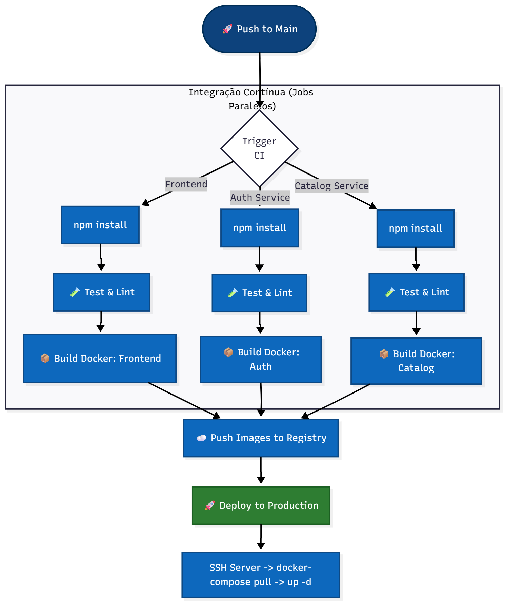

# 🚀 Entrega Contínua (CI/CD)

Esta seção define o pipeline de automação para garantia de qualidade do código do sistema Blockbuster.

## 1. Pipeline de CI (Quality Gate)

Adotamos um fluxo de Integração Contínua (CI) focado na qualidade do código. O pipeline é acionado automaticamente a cada `push` para o repositório, garantindo que nenhuma alteração quebre a build ou os testes existentes.

### Visualização do Fluxo
O diagrama abaixo ilustra a validação automática dos microsserviços.



### Definição do Workflow

O arquivo de configuração `.github/workflows/main.yml` executa as seguintes verificações em um ambiente limpo (Ubuntu/Node.js):

1.  **Auth Service:**
    * Instalação de dependências limpa (`npm ci`).
    * Verificação de Tipagem Estática (TypeScript Build).
    * Execução de Testes Unitários (Jest).
2.  **Catalog Service:**
    * Instalação, Build e Testes.
3.  **Frontend:**
    * Verificação de estilo de código (Linting).

Se qualquer uma dessas etapas falhar, o commit é marcado como "Falho" (❌), alertando a equipe para correção imediata antes de qualquer merge.

---

## 2. Estratégia de Execução Local

Como o projeto é executado localmente para fins acadêmicos, a estratégia de "Deploy" consiste em:

1.  **Pré-requisitos:** Ter Docker e Docker Compose instalados.
2.  **Configuração:** Criar o arquivo `.env` na raiz com as credenciais locais.
3.  **Execução:** Rodar o comando `docker-compose up --build`.

Esta abordagem garante que o ambiente de desenvolvimento seja reproduzível em qualquer máquina que possua Docker, simulando a containerização de produção.

---

## 3. Runbook de Incidentes (Desenvolvimento)

Guia para resolver problemas comuns durante a execução local.

### 🚨 Incidente: Erro de Conexão com Banco
**Erro:** `Connection refused` ou `ECONNREFUSED` nos logs.
**Causa:** O container do MySQL ainda não estava pronto quando o backend tentou conectar.
**Solução:** O sistema possui *healthchecks*, aguarde alguns segundos que os containers irão reiniciar automaticamente até conectar.

### 🚨 Incidente: Alterações não refletem
**Sintomas:** Mudei o código mas o comportamento continua antigo.
**Causa:** O Docker está usando uma imagem antiga em cache.
**Solução:** Forçar a recriação do build:
```bash
docker-compose up -d --build
